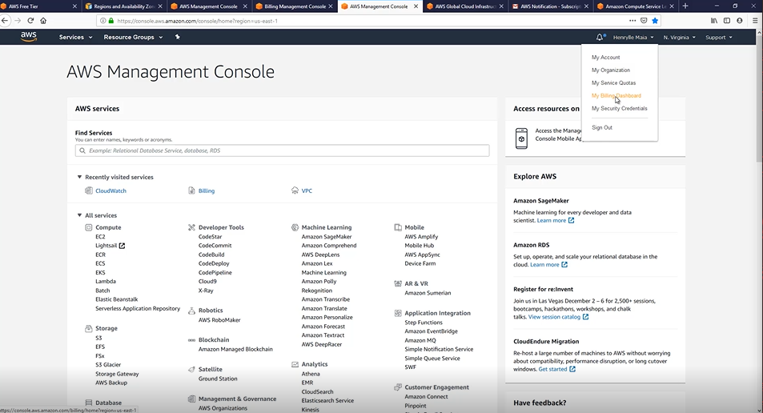

# Formação AWS (Em Edição - Rascunho)

## Criação de Conta

Para criarmos a conta precisamos acessar : https://aws.amazon.com/

Ao entrar no link deve-se clicar no botão "Create an AWS Account", se será direcionado
para a página a seguir.

Nessa página, será necessário preencher os dados para criação de sua conta como :
email, senha e um nome único para criação de sua conta (AWS Account Name).

No próximo passo, se preenche os dados básicos de sua localização, usados normalmente
para emissão de nota fiscal, quando se tem uma fatura para pagamento.
No próximo passo teremos que preencher os dados do cartão de crédito e não
é possível a criação de uma conta sem um cartão de crédito **INTERNACIONAL**, pois 
a cobrança é realizada em dolar.
Após os dados preenchidos seremos direcionados para tela inicial do console.

Para verificar em qual região está logada basta acessar o menu no top:

## Free Tier

Free Tier, normalmente é tempo que você tem para uso gratuito para utilização da AWS. 
Para alguns serviços temos até 12 meses sem cobranças, mas depende do serviço e como será o uso desse
serviço.
Exemplo: t2.micro tem um limite de 750hrs por mês.

## Billing e Configuração

Alarmes para ser notificado em caso de extrapolar valores de pagamento e para evitar
sustos no final do mês. Além disso conseguimos informaçöes da fatura e até mesmo
cada serviço que está gerando cobranças. Para acessar o billing :

Abaixo os dados da tela inicial, onde pode-se verificar os dados da sua fatura :

Para configurarmos entraremos no menu "Billing Preferences":

## Regiöes x Zona de Disponibilidade (AZ)

Regiöes são grandes áreas que a aws tem espalhados pelo globo terreste e nessa área se concentra
vários serviços disponíveis para uso, até alguns mais especificos.
Zona de disponilidade imagine como servidores que estão ligados oferecendo determinados
serviços independentes para aquela região, delimitados por uma certa distância. Eles
podem estar a alguns kilometros uns dos outros, isso para garantir o minimo de segurança
para o caso de algum fenomeno natural.

SLA Aws: 

Link para averiguar as zonas e regiões:
https://aws.amazon.com/pt/about-aws/global-infrastructure/regions_az/ 

## Serviço Dedicado x Compartilhado

Serviço dedicado: serviço onde precisamos inicia ele e estaremos realizando o pagamento
por hora do mesmo (explicação de forma mais simples). 
* Vantagem: o serviço estaria dedicado para minha aplicação, por exemplo, uma instância EC2, 
ao iniciar uma instancia EC2 e hospedar minha aplicação na mesma, essa instância seria totalmente
dedicada a minha aplicação.
* Desvantagem: seria totalmente responsável pela instância, caso a instância fica indisponível em
alguma regiao, a mesma poderia ficar offline.
  
Serviço compartilhado: o serviço que está sempre disponível e não precisa se preocupar com seu
gerenciamento. Um exemplo simples que podemos levantar é o S3, não pagariamos por hora de uso,
pagariamos somente por trafego gerado (download e upload) e armazenamento.

## Escabilidade :
* Escale out: escalar pra fora, adicionar novos nós para aumentar e suprir a demanda.
* Escale Up : aumentar a quantidade (poder computacional) de hardware para ajudar no processamento.
* Escale down : diminuir a quantidade (pode computacional) de hardware para ajudar no processamento.

## Ec2
Explicando de modo simples, consiste em uma máquina virtual hospedada no AWS.
E temos dois tipos sistemas operacionais padrões disponiveis :  Linux e Windows.
Para acessar a máquina Linux, normalmente ssh e para windows, terminal service.
A cobrança pelo serviço normalmente é cobrado pelo recurso computacional utilizado por segundos
ou por hora, sem compromisso. Ou seja, pode se subir / ligar uma máquina utilizar por pelo periodo
que deseja e depois desligar. Detalhe importante é que a cobrança minima é de 60 segundos.

As instancias disponiveis podem ser encontradas no link a seguir
https://aws.amazon.com/pt/ec2/instance-types/

Normalmente o nome de uma instância é composta por uma sigla como por exemplo : a1.large, onde
abaixo descrevemos mais sobre.

| Familia        | Geração          | Tamanho da Instância  |
| ------------- |:-------------:| -----:|
|  a    | 1 | large |

Em cada tamanho distância temos a variação vCpu (processamento da máquina) e na memoria.
Ebs only é o mesmo que não existe nenhum disco atachado a ela, precisamos alocar um disco pra ela,
quando matarmos a instância, o disco/conteúdo será armazenado sem perda de dados.
Já disco efemero, significa que quando desligarmos a máquina o disco também será descartado, é um
disco temporário, apenas para funcionamento da máquina.

Link para comparação de instâncias ec2 : https://instances.vantage.sh/

## RDS

Serviço da AWS para hospedagem de banco.
